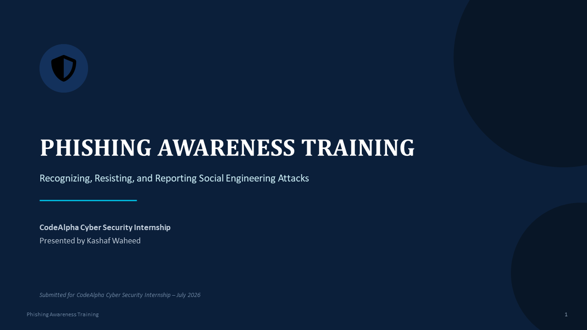
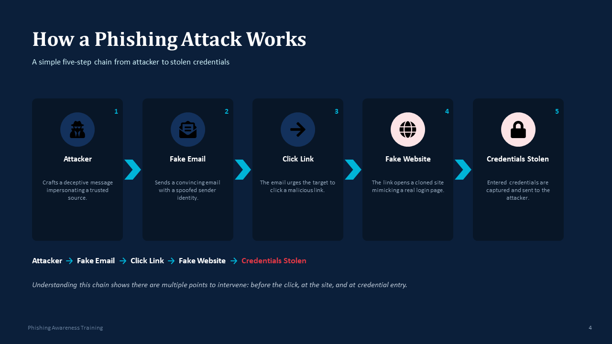
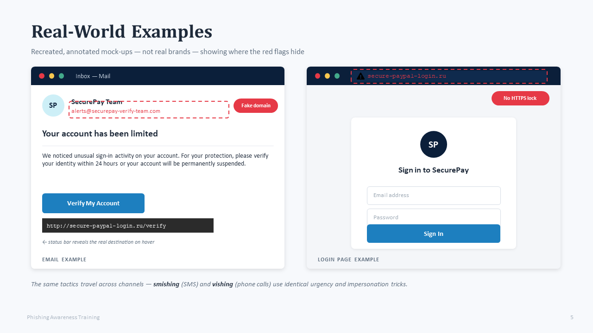
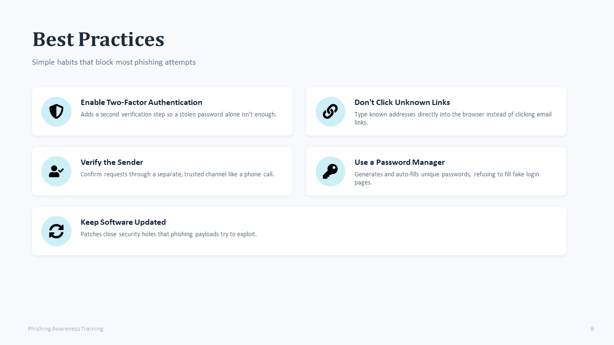
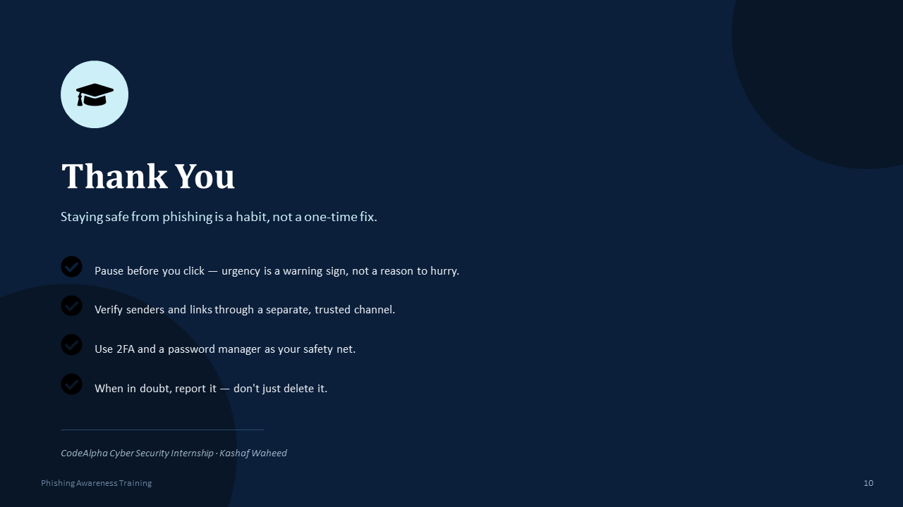

# 🛡️ Phishing Awareness Training

## 📌 Overview

This project was created as part of my CodeAlpha Cyber Security Internship.

The objective of this project is to educate users about phishing attacks, common social engineering techniques, and cybersecurity best practices to stay safe online.

---

## 📚 Topics Covered

- What is Phishing?
- Types of Phishing
- How a Phishing Attack Works
- Real-World Examples
- Identifying Phishing Emails
- Social Engineering
- Best Practices
- Interactive Quiz

---

## 🛠️ Tools Used

- Microsoft PowerPoint

---

## 📂 Files

- Phishing_Awareness_Training_Kashaf_Waheed.pptx

---
---
## 📥 Download Presentation

You can download the PowerPoint presentation here:

📄 [Phishing_Awareness_Training_Kashaf_Waheed.pptx](Phishing_Awareness_Training_Kashaf_Waheed.pptx)

---

## 📸 Project Screenshots

### Title Slide

### Phishing Attack Flow

### Real-World Example

### Best Practices

### Conclusion

## 👨‍💻 Author

**Kashaf Waheed**

CodeAlpha Cyber Security Intern
